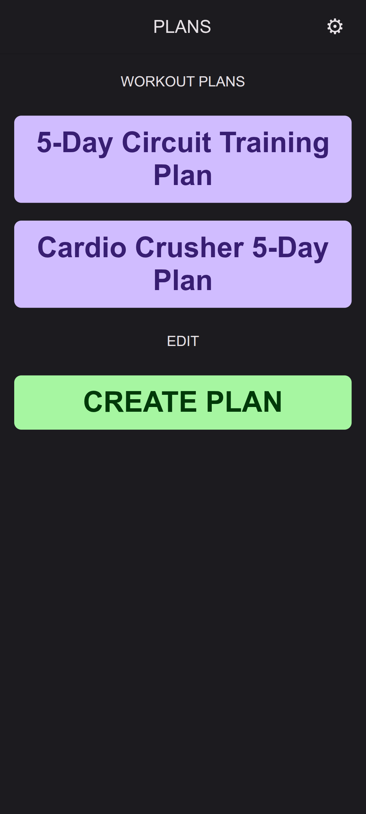
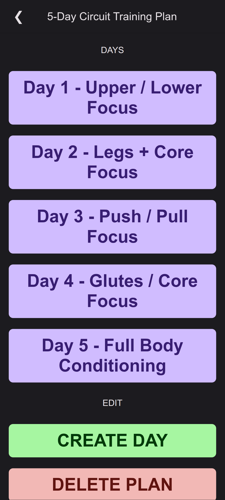
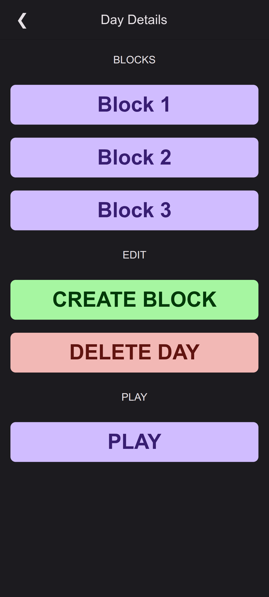
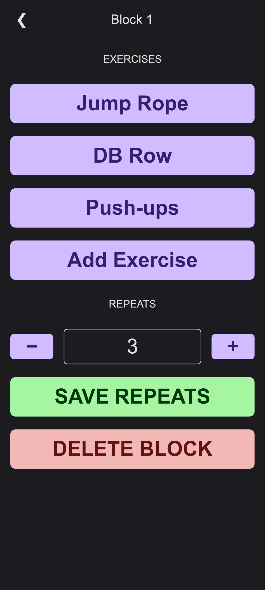
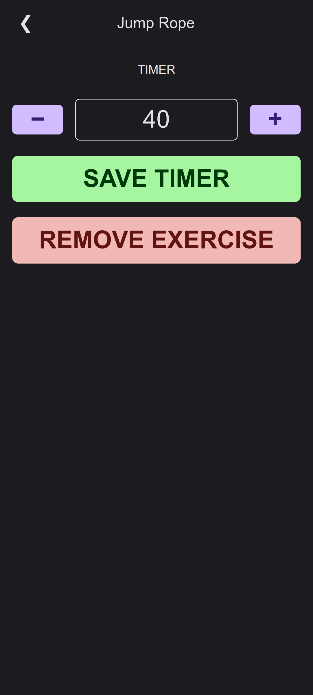
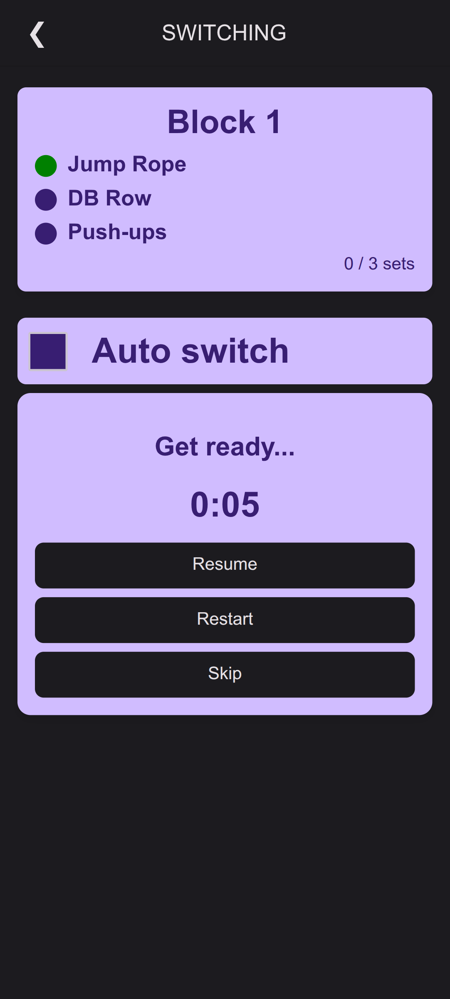
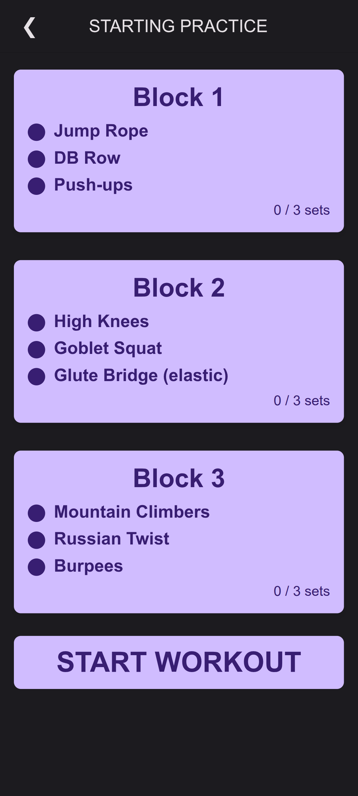
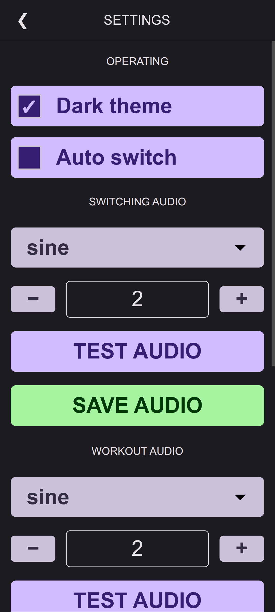

# Workout App

A simple workout plan manager that runs entirely in your browser.

## What it does

Create and manage workout plans with a hierarchical structure:

- **Plans** contain multiple days
- **Days** contain workout blocks  
- **Blocks** contain exercises with set/rest timers
- **Exercises** have customizable training times

## Features

- Timer-based workouts with audio cues
- Auto-switching between exercises
- Import/export workout plans as JSON
- Local storage (no server required)
- Customizable themes
- Plan sharing via JSON export

## Screenshots

| Plans page | Plan details | Day view |
|------------|--------------|----------|
|  |  |  |

| Block configuration | Exercise settings | Workout ready |
|-------------------|------------------|---------------|
|  |  |  |

| Starting workout | Settings |
|------------------|----------|
|  |  |

## How to use

1. **Main page**: View existing plans or create new ones
2. **Plan view**: Manage days within a plan
3. **Day view**: Create blocks and start workouts
4. **Block view**: Add exercises and set repetitions
5. **Exercise view**: Adjust timers or remove exercises

## Settings

- Theme selection
- Auto-switch between exercises
- Audio switching cues
- Export/import plans
- Reset all data

## Installation

1. Clone or download the files
2. Update the URL in `manifest.json` if hosting elsewhere
3. Serve the files from any web server
4. Open in browser

## Plan sharing

Export plans as JSON to share with others or use with AI tools like ChatGPT. The structured format makes it easy to generate custom workout plans programmatically.

## Technical notes

- No frameworks (vanilla JS with React-like patterns)
- No backend required
- All data stored in browser localStorage
- Works offline after initial load
